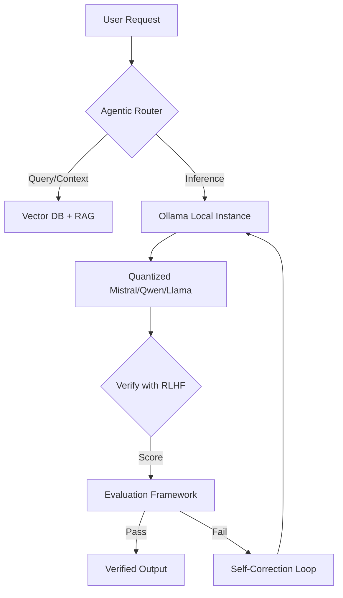

# 👋 David Robert Koch
## Systems Architect | DevOps Engineer | Technical Artist

<div align="center">
  
  **Bridging infrastructure, AI, and creative 3D workflows**
  
  [](https://6ooflames.github.io/resume/)
  [](mailto:davidrobertkochelsdorf@gmail.com)
  
  <div style="display:flex; gap:10px; margin-top:15px;">
    
    
    
    
    
  </div>
  
</div>

---

### 🎯 The "Strategic Synthesis" Approach

I approach **code**, **infrastructure**, and **creative systems** as interconnected domains. My work bridges:

```
Systems Architecture ←→ AI Infrastructure ←→ Creative 3D Workflows
       ↓                    ↓                    ↓
Linux/DevOps           Local LLMs            Blender/C++/Rust
Security Auditing      RLHF Methodology      Game Modding
Agentic Systems        Prompt Engineering    Photoscan/Modeling
```

---

### 🛠️ Core Competencies

#### ☁️ **Infrastructure & DevOps**
- Expert in Linux (Arch/CachyOS), Proxmox, and kernel-level security hardening
- 10-phase security audit frameworks for high-performance systems
- Virtualization and containerization for AI workloads

#### 🤖 **AI & Machine Learning**
- **Local LLM Orchestration**: Ollama, RAG pipelines, quantized models (Mistral, Llama, Qwen)
- **Agentic Tool-Use**: Building systems where AI autonomously uses external tools
- **RLHF Experience**: Professional LLM alignment and evaluation (DataAnnotation, Outlier, Micro1.ai)
- **Hardware Optimization**: Shared memory configuration, VRAM management for APUs/GPUs

#### 🎨 **3D & Technical Art**
- **Blender Expertise**: Photoscan modeling, modular environment design, character modeling
- **Game Modding**: Creation Kit/Gamebryo reference import tools (4 stars ⭐⭐⭐⭐)
- **Real-Time Rendering**: GLB/WebGL exports, optimized for interactive web viewing
- **Photoscan Vehicle Reconstruction**: 774MB Tesla Model high-fidelity scans

---

### 🚀 Featured Projects

| Repository | Description | Tech Stack | Stars |
|---|---|--|-|
| **[`resume`](https://github.com/6ooflames/resume)** | Interactive GitHub Pages resume with technical & 3D portfolios | HTML, TailwindCSS | ⭐ |
| **[`llm-alignment-methodology`](https://github.com/6ooflames/llm-alignment-methodology)** | NDA-safe overview of RLHF, prompt engineering & LLM evaluation | Documentation | ⭐ |
| **[`F4RefToBlender`](https://github.com/6ooflames/F4RefToBlender)** | Import Skyrim/Gamebryo references into Blender | Python, C++ | ⭐⭐⭐⭐ |
| **[`6ooflames`](https://github.com/6ooflames/6ooflames)** | GitHub profile configuration | Markdown, Mermaid | ⭐ |

**Coming Soon:**
- `ELENA-Infrastructure` - Agentic routing system for local LLM backends (private)
- `Blender-Showcase` - Interactive 3D renders with GLB/WebGL viewer (in progress)

---

### 💼 Professional Experience

#### **Current Focus (2024-2026)**
- **Systems Architect** - Building secure, optimized Linux environments for AI workloads
- **Co-Founder @ Dalmer Co.** - Cross-border app ecosystem ("Butter" project), technical lead
- **AI Trainer** - RLHF and LLM alignment for multiple platforms (confidential clients)

#### **Previous Experience**
- **DevOps Trainee @ Deutsche Telekom** (2023-2024) - Security updates, Linux infrastructure
- **Junior Cloud Engineer @ Imos GmbH** (2024) - VM environments, macOS on Proxmox
- **Game Design Student @ Designschule Schwerin** (2022-2023) - 3D modeling, game art basics

---

### 🧠 Agentic AI Architecture

Visualizing my approach to local LLM systems:



**Key Principles:**
1. **Local-first**: All inference runs on-prem (privacy & low latency)
2. **Hardware-aware**: Optimize for shared memory (APUs) and VRAM constraints
3. **Evaluation-driven**: RLHF frameworks for quality assurance
4. **Tool-use enabled**: AI can call external APIs, databases, file systems

---

### 🎨 Creative & 3D Portfolio

My creative work demonstrates technical precision in 3D workflows:

#### **Major Projects**
- **Photoscan Tesla Model** - 774MB high-fidelity vehicle reconstruction
- **Modular Classroom Environment** - Complete asset pack with PBR textures
- **Vault 111 Cryo Chamber** - Fallout-inspired post-apocalyptic scene (1.7GB)
- **Character Series** - 8K renders exploring lighting and texture detail

#### **Tools & Techniques**
- Photoscan → MeshLab → Blender pipeline
- UV unwrapping, texture baking, optimization
- GLB/WebGL exports for web-based 3D viewing
- Modular design patterns for game environments

👉 **View Full Portfolio**: https://6ooflames.github.io/resume/#creative-projects

---

### 🌍 Languages

- **English**: Native-level fluency (professional translator background)
- **Deutsch**: Native speaker
- **Technical Documentation**: Specialized in semantic precision

---

### 📊 Technical Stack

```
┌─────────────────────────────────────────────────────────────┐
│  Core Engineering      │  Cloud & Infrastructure           │
│  ───────────────────── │  ────────────────────────────────  │
│  • C++ / Rust / C#     │  • Arch Linux / CachyOS           │
│  • Python              │  • Proxmox / Virtualization       │
│  • Bash / Shell        │  • Docker / Containers            │
│                       │                                    │
│  AI/ML Stack          │  Creative & 3D                    │
│  ───────────────────── │  ────────────────────────────────  │
│  • Ollama / Local LLMs │  • Blender 3D                     │
│  • RAG / Vector DBs    │  • Photoscan / MeshLab            │
│  • RLHF Evaluation     │  • Gamebryo / Creation Kit        │
│  • Mistral / Qwen      │  • C++ Graphics Programming       │
│                       │                                    │
│  Security & Audit     │  Collaboration Tools              │
│  ───────────────────── │  ────────────────────────────────  │
│  • Kernel Hardening    │  • Git / GitHub                   │
│  • AppArmor / SElinux  │  • Notion / Obsidian              │
│  • 10-Phase Audits     │  • Cross-border coordination       │
└─────────────────────────────────────────────────────────────┘
```

---

### 🤝 Open to

- **Collaboration** on AI infrastructure, security auditing, or 3D tooling
- **Consultation** for LLM alignment, local deployment strategies
- **Creative Projects** combining technical systems with 3D workflows
- **Speaking Engagements** on "Strategic Synthesis" approach

**Not accepting:**
- Proprietary dataset sharing (NDA commitments)
- Undisclosed client work without proper agreements

---

### 📜 Philosophy

> *"I treat code like architecture—designing systems where every component serves a purpose, and every connection is intentional."*

My "Strategic Synthesis" approach integrates:
1. **Systems Thinking** - Identifying protocols and core nodes in complex architectures
2. **Technical Precision** - Native-level detail in code and geometry
3. **Security-First Design** - Building audit frameworks into infrastructure from day one
4. **Creative Problem-Solving** - Bridging rigid systems with adaptable creative workflows

---

<div align="center">
  <p>
    <strong>👀 Currently exploring:</strong>
    Agentic multi-agent systems · Quantum-safe infrastructure · WebXR 3D rendering
  </p>
  <p>
    <a href="https://6ooflames.github.io/resume/">View Resume</a> •
    <a href="mailto:davidrobertkochelsdorf@gmail.com">Contact Me</a> •
    <a href="https://github.com/6ooflames/llm-alignment-methodology">RLHF Methodology</a>
  </p>
  <p><sub>© 2026 David Robert Koch | Built with strategic synthesis</sub></p>
</div>
